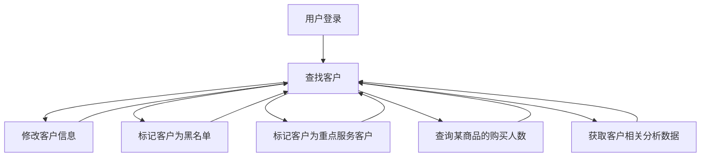
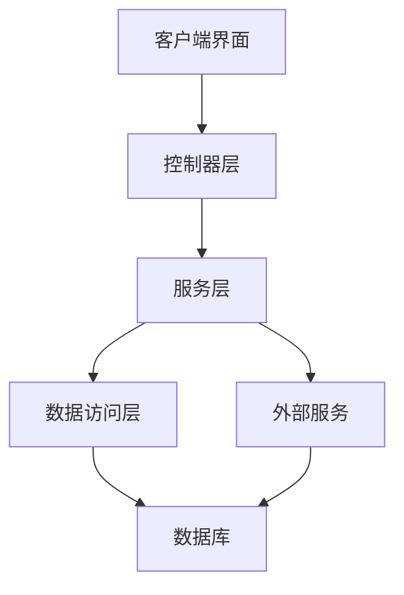
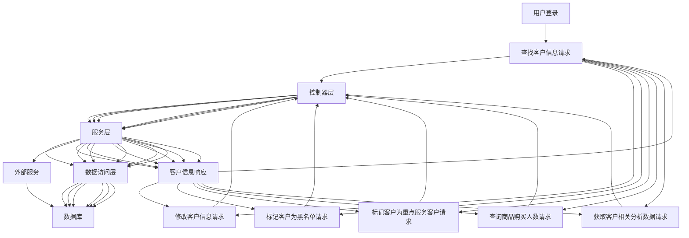

使用JavaEE框架技术，开发《X公司客户服务系统》，X公司有三类客户，vip客户，普通客户（已经购买过公司产品），同时还有官网的注册潜在客户（未购买过产品）。本系统可以定期从在线商品销售服务系统导入客户信息，系统需要对客户进行基本的管理，包括但不限于以下功能：
根据销售日期查找客户
根据客户名称查找客户
根据销售产品筛选客户
根据客户要求修改客户信息
根据客户不规范行为，标记为黑名单
根据客户行为，标记为近期重点服务客户
查询某商品的客户购买人数
获取客户相关分析数据

根据需求，分析设计编码实现系统。
提交以下资料：
1、需求分析文档
2、系统设计文档
3、系统源代码
4、系统测试用例文档及源代码


## 一、数据库表：

1. **客户表**：存储客户的基本信息，如ID、客户ID、姓名、联系方式、客户类型（VIP客户、普通客户、潜在客户）、是否在黑名单、创建时间、更新时间。

2. **产品表**：存储公司销售的产品信息，如产品ID、产品名称、产品描述、产品价格。

3. **销售表**：存储销售记录，如购买客户ID、购买产品ID、销售日期等。这个表可以用来根据销售日期查找客户，根据销售产品筛选客户，查询某商品的客户购买人数等。

4. **黑名单表**：存储被标记为黑名单的客户信息，如客户ID、标记日期、标记原因等。

5. **近期重点客户表**：存储被标记为重点客户的信息，客户ID、标记日期。

   
   
   

[在你的数据库连接URL后面添加 `serverTimezone` 参数](https://stackoverflow.com/questions/50493398/mysql-connector-error-the-server-time-zone-value-central-european-time)[1](https://stackoverflow.com/questions/50493398/mysql-connector-error-the-server-time-zone-value-central-european-time)[2](https://blog.csdn.net/dreamboy_w/article/details/96505068)[3](https://blog.csdn.net/leeadmin/article/details/89280213)[4](https://blog.csdn.net/junbs/article/details/103202804)[。例如，如果你在中国（东八区，即GMT+8），你可以将连接字符串改为 `jdbc:mysql://localhost/dbname?serverTimezone=Asia/Shanghai`](https://blog.csdn.net/dreamboy_w/article/details/96505068)

 `jdbc:mysql://localhost/dbname?serverTimezone=Asia/Shanghai`](https://blog.csdn.net/dreamboy_w/article/details/96505068)

## 二、功能

1. **定期从在线商品销售服务系统导入客户信息**：注册客户信息
2. **管理客户**
   - [x] 根据销售日期查找客户
   - [x] 根据客户名称查找客户 
   - [x] 根据销售产品筛选客户
   - [x] 根据客户要求修改客户信息
   - [x] 根据客户不规范行为，标记为黑名单
   - [x] 根据客户行为，标记为近期重点服务客户
   - [x] 查询某商品的客户购买人数
   - [x] 获取客户相关分析数据


## 三、流图

核心业务流程图




功能架构图




核心数据流图




## 四、实现逻辑

### (一)前期准备

#### 	加装依赖

1. **Spring Boot Starter Data JPA**: 这是Spring Boot的一个启动器，用于简化Java持久性API（JPA）的使用。它包含了Spring Data JPA、Spring ORM和Hibernate等组件。

2. **Spring Boot Starter Web**: 这是Spring Boot的一个启动器，用于构建web应用，包括RESTful应用。它包含了Spring MVC、Spring Web等组件。

3. **MySQL Connector/J**: 这是MySQL的官方JDBC驱动，用于连接MySQL数据库。

   在yml里连接数据库

   ```
   spring:
     application:
       name: company_customer_service_system
     datasource:
       url: jdbc:mysql://localhost:3306/xxx
       username: 
       password:
   ```

4. **Project Lombok**: 这是一个Java库，可以通过注解的方式，使Java代码更简洁，减少模板代码的编写，如getter、setter方法等。

5. **Spring Boot Starter Test**: 这是Spring Boot的一个启动器，用于测试Spring Boot应用。它包含了JUnit、Spring Test、Spring Boot Test、AssertJ、Hamcrest、Mockito、JSONassert等组件。

6. **Knife4j OpenAPI3 Jakarta Spring Boot Starter**: 这是一个用于生成和展示OpenAPI 3文档的工具。

   要在yml里配置

   ```
   springdoc://文档中接口调式
     group-configs:
       - group: "company_customer_service_system api"
         paths-to-match: "/**"
         packages-to-scan: cn.edu.tsu.company_customer_service_system
     swagger-ui:
       enabled: true
   knife4j:
     enable: true
     setting:
       enable-footer-custom: true
       footer-custom-content: CopyRight@TSU.chang
   ```

7. **MyBatis Spring Boot Starter**: 这是MyBatis的Spring Boot启动器，用于简化MyBatis在Spring Boot应用中的配置和使用。

### （二）实现功能

层次结构：先写持久实体类和Dao包（`Dao包`继承了`JpaRepository`，这意味着它继承了一系列用于访问数据库的方法，例如`save`（保存一个实体）、`findById`（通过ID查找一个实体）、`findAll`（查找所有实体）等。），再写业务对象类，根据业务对象类写service接口->实现类，实现功能最后要将业务类转换成持久类，最后写controller，实现web接口调试。

在写controller前要生成测试类对方法进行测试

##### 先解决只含顾客类的方法

新增客户

根据客户名称查找客户

根据客户要求修改客户信息

写到这里我发现一个问题，我的系统无法解决重名用户，不管了，接着做

##### 接下来要做有关销售的工作

新增销售记录

根据销售产品筛选客户

根据销售日期查找客户

##### 接下来做标记客户功能

根据客户不规范行为，标记为黑名单，填写黑名单表


根据客户行为，标记为近期重点服务客户，我的逻辑是当一个客户一周内购买次数超过3次，则标记为重点服务客户，凌晨自动执行，此标记在一周后自动取消


接下来生成客户相关数据（不需存到数据库，实时生成）

**客户相关数据**：存储分析后的客户数据，客户id，客户姓名，是否在黑名单，客户类型，购买产品

